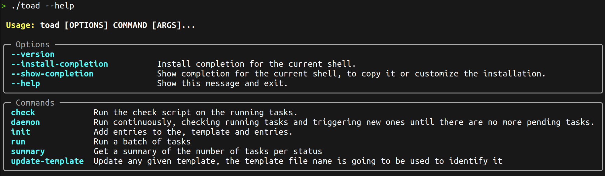

# TOAD

[](https://github.com/mberacochea/toad/actions/workflows/main.yml)

A very simple task booking system. It's just sql, jinja2 and python.


## Install it from Github releases

You can download a binary, generated with [pyinstaller](https://pyinstaller.org/) from the releases tab.

## Toad cli commands



## Usage

The first step is to create a database and populate it with the `entries`.

```bash
toad init tasks.db --template examples/motus_pipeline/motus_pipeline.jinja2 --entries-file examples/motus_pipeline/entries.txt
```
This command will create a `tasks.db` [sqlite](https://www.sqlite.org/), this database will be used to keep track of the status of the tasks.

Using the example in [examples/motus_pipeline/entries.txt](examples/motus_pipeline/entries.txt).

TODO: improve the layout of this code snippet

```
$ sqlite3 tasks.db "select * from entry limit 10;"
created_at                  updated_at                  id          name      
--------------------------  --------------------------  ----------  ----------
2023-06-18 18:44:44.621508  2023-06-18 18:44:45.139609  1           SRR5787989
2023-06-18 18:44:44.621508  2023-06-18 18:44:45.358367  2           SRR5787990
2023-06-18 18:44:44.621508  2023-06-18 18:44:45.511141  3           SRR5787991
2023-06-18 18:44:44.621508  2023-06-18 18:44:45.774346  4           SRR5787992
2023-06-18 18:44:44.621508  2023-06-18 18:44:46.067799  5           SRR5787993
2023-06-18 18:44:44.621508  2023-06-18 18:44:46.279143  6           SRR5787994
2023-06-18 18:44:44.621508  2023-06-18 18:44:46.460734  7           SRR5787995
2023-06-18 18:44:44.621508  2023-06-18 18:44:46.703233  8           SRR5787996
2023-06-18 18:44:44.621508  2023-06-18 18:44:46.879553  9           SRR5787997
2023-06-18 18:44:44.621508  2023-06-18 18:44:47.152089  10          SRR5787998

$ sqlite3 toad_test.db "select * from task limit 10;"
created_at                  updated_at                  id          entry_id    template_id  status      task_launch_exitcode  task_launch_stdout  task_launch_stderr  task_execution_exitcode  task_execution_stdout  task_execution_stderr
--------------------------  --------------------------  ----------  ----------  -----------  ----------  --------------------  ------------------  ------------------  -----------------------  ---------------------  ---------------------
2023-06-18 18:44:44.621508  2023-06-18 18:44:54.943962  51          51          1            pending     NULL                  NULL                NULL                NULL                     NULL                   NULL                 
2023-06-18 18:44:44.621508  2023-06-18 18:44:55.093358  52          52          1            pending     NULL                  NULL                NULL                NULL                     NULL                   NULL                 
2023-06-18 18:44:44.621508  2023-06-18 18:44:55.244337  53          53          1            pending     NULL                  NULL                NULL                NULL                     NULL                   NULL                 
2023-06-18 18:44:44.621508  2023-06-18 18:44:55.389798  54          54          1            pending     NULL                  NULL                NULL                NULL                     NULL                   NULL                 
2023-06-18 18:44:44.621508  2023-06-18 18:44:55.818848  55          55          1            pending     NULL                  NULL                NULL                NULL                     NULL                   NULL                 
2023-06-18 18:44:44.621508  2023-06-18 18:44:56.083998  56          56          1            pending     NULL                  NULL                NULL                NULL                     NULL                   NULL                 
2023-06-18 18:44:44.621508  2023-06-18 18:44:56.293171  57          57          1            pending     NULL                  NULL                NULL                NULL                     NULL                   NULL                 
2023-06-18 18:44:44.621508  2023-06-18 18:44:56.426117  58          58          1            pending     NULL                  NULL                NULL                NULL                     NULL                   NULL                 
2023-06-18 18:44:44.621508  2023-06-18 18:44:56.552228  59          59          1            pending     NULL                  NULL                NULL                NULL                     NULL                   NULL                 
2023-06-18 18:44:44.621508  2023-06-18 18:44:56.689957  60          60          1            pending     NULL                  NULL                NULL                NULL                     NULL                   NULL                 
```

### Template

The task template needs to contain the self-contained bash command to be used to run the task. Toad doesn't assume anything, it will just merge the template with the entry name and will launch the instruction.

You can see an example in [examples/motus_pipeline/motus_pipeline.jinja2](examples/motus_pipeline/motus_pipeline.jinja2).

## Run tasks

To run tasks you need to run:
```
toad run toad_test.db [--batch-size] 
```

### Check script

In order to check the status of the jobs, the user needs to provide a python script to do it. The script needs to have a method with the following name and signature:

```python
def check(entry_name: str, launch_exitcode: str, launch_stdout: str, launch_stderr: str):
  """Run this method to check if an entry task is either still running, succesfully completed or failed.
  :entry_name: The entry to be checked
  :launch_exitcode: The exit code when the task was launched
  :launch_stdout: The stdout when the task was launched
  :launch_stdout: The stderr when the task was launched
  :return: [ bool, int, str, str] -> is the task stil running, exit code when checking, stdout and stderr of the command used to check.
  """
  pass
```

You can see an example in [examples/motus_pipeline/motus_pipeline_check.py](examples/motus_pipeline/motus_pipeline_check.py)

## Check tasks status

To run the checks on jobs already running:
```bash
toad check toad_test.db --check-script check_script.py
```

## Development

Read the [CONTRIBUTING.md](CONTRIBUTING.md) file.
